# 🗺 Карта обучения — Python 2026

> Визуальная схема всех этапов курса с зависимостями. Каждый блок — кликабельная ссылка на материал этапа.

## 📍 Общий маршрут

```mermaid
flowchart TD
    S0["Stage 0<br/>Environment<br/>uv, ruff, pyright"] --> S1["Stage 1<br/>Basics"]
    S1 --> S2["Stage 2<br/>Idiomatic"]
    S2 --> S3["Stage 3<br/>OOP & SOLID"]
    S3 --> S4["Stage 4<br/>Typing<br/>Pydantic v2"]
    S4 --> S5["Stage 5<br/>stdlib"]
    S5 --> S6["Stage 6<br/>Async<br/>asyncio, anyio"]
    S6 --> S7["Stage 7<br/>Testing<br/>pytest, Hypothesis"]
    S7 --> S8["Stage 8<br/>CPython internals<br/>GIL, JIT"]
    S8 --> S9["Stage 9<br/>Web<br/>FastAPI"]
    S9 --> S10["Stage 10<br/>Databases<br/>SQLAlchemy 2.x"]
    S10 --> S11["Stage 11<br/>Data & ML<br/>Polars, DuckDB"]
    S11 --> S12["Stage 12<br/>DevOps<br/>Docker, OTel"]
    S12 --> S13["Stage 13<br/>Architecture<br/>Hex, DDD, Saga"]
    S13 --> S14["Stage 14<br/>Vibecoding<br/>AI-pair"]
    S13 --> S15P["Stage 15<br/>Parsing"]
    S15P --> S15A["Stage 15<br/>Antibot"]

    click S0 "./stage-00-environment.md"
    click S1 "./stage-01-basics.md"
    click S2 "./stage-02-idiomatic.md"
    click S3 "./stage-03-oop.md"
    click S4 "./stage-04-typing.md"
    click S5 "./stage-05-stdlib.md"
    click S6 "./stage-06-async.md"
    click S7 "./stage-07-testing.md"
    click S8 "./stage-08-cpython.md"
    click S9 "./stage-09-web.md"
    click S10 "./stage-10-databases.md"
    click S11 "./stage-11-data-ml.md"
    click S12 "./stage-12-devops.md"
    click S13 "./stage-13-architecture.md"
    click S14 "./stage-14-vibecoding.md"
    click S15P "./stage-15-parsing.md"
    click S15A "./stage-15-antibot.md"
```

## 🎯 Треки специализации

После прохождения 0–8 этапов (Python-фундамент) можно выбрать трек по интересам:

### 🌐 Backend
`Stage 8 → 9 (Web) → 10 (DB) → 12 (DevOps) → 13 (Architecture)`

Цель: senior backend / архитектор. Стек: FastAPI, SQLAlchemy 2.x, Postgres, Docker, OTel, hex/DDD.

### 📊 Data & ML
`Stage 8 → 11 (Data & ML) → 14 (Vibecoding)`

Цель: ML / data engineer. Стек: Polars, DuckDB, Parquet, LangGraph, RAG, LLM-агенты.

### 🕷 Scraping & интеграции
`Stage 8 → 15 Parsing → 15 Antibot`

Цель: дата-инженер по веб-источникам. Стек: httpx, selectolax, Playwright, curl_cffi, scrapy, crawlee.

### 🏗 Architecture & DevOps
`Stage 9 → 10 → 12 → 13`

Цель: tech lead. Стек: hex/DDD, Saga, Outbox, ADR, OTel, k8s.

## ⏱ Ориентир по времени

| Темп | Часов/неделю | Срок |
|---|---|---|
| Спокойно | 5–7 ч | 8–10 мес |
| Стандарт | 10–12 ч | 5–6 мес |
| Интенсив | 20+ ч | 2.5–3 мес |

## ✅ Чеклист готовности после курса

- [ ] Уверенно читаю и пишу async-код (TaskGroup, cancel scopes, timeouts)
- [ ] Pyright strict без `# type: ignore`
- [ ] Pytest + Hypothesis + coverage > 80% в pet-проекте
- [ ] Поднял FastAPI-сервис в проде (Docker + OTel + structlog)
- [ ] Понимаю разницу между Outbox, Saga, two-phase commit
- [ ] Сделал свой стартовый шаблон проекта
- [ ] Веду ADR-логи

## 📚 Ресурсы карты

- 🐍 [t.me/pythonl](https://t.me/pythonl) — главный канал на каждом этапе
- 📚 [Папка каналов](https://t.me/addlist/8vDUwYRGujRmZjFi)
- 📖 [Глоссарий](./glossary.md)
- 🎯 [Промпты для LLM](./prompts/README.md)

---

[← Главная курса](./README.md) · [← Корень репо](../README.md)
